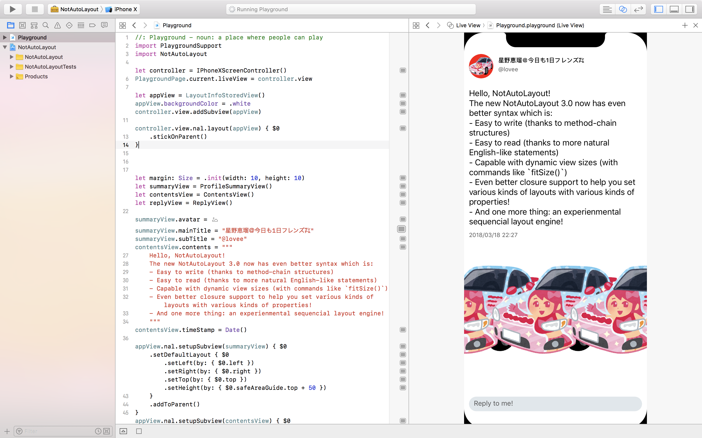

# NotAutoLayout

[](https://developer.apple.com/iphone/index.action)
[](https://developer.apple.com/swift)
[](https://www.bitrise.io/app/a650632c681bd908)
[](https://github.com/Carthage/Carthage)

## -The only<a id="q1" href="#a1"><sup>1</sup></a> layout framework that treats layout human-erros<a id="q2" href="#a2"><sup>2</sup></a> as a Build-time error-

NotAutoLayout is a framework to help you layout subviews *without* Auto Layout constraints.

Please note that this framework hasn't been widely tested yet, and currently it's for iOS only.

Please open an issue or send me a pull request if you have any problems, better ideas or any other things you want me to know.

## Why NotAutoLayout

Apple introduced Interface Builder and Storyboard to help developers create views visually, which is a very good idea. But after iPhone 5, things changed. There're more and more screen resolutions with different aspect ratios that drives developer crazy. To solve this problem, Apple introduced Auto Layout and Size Classes.

But the problem is, they're just making things more complicated (and that's why they introduced UIStackView and NSGridView, maybe). You have to create dozens of constraints in order to just create a very simple view in the storyboard, which makes the system complicated and hard to debug. In addition, there is no hierarchy for the constraints, which means that you have to manage all those dozens of constraints in one place, which is just not intuitive because we always add many subviews to views, and even more further subviews to subviews, which makes a hierarchy of views.

So, there are some frameworks like [Snapkit](https://github.com/SnapKit/SnapKit) and [PureLayout](https://github.com/PureLayout/PureLayout) to help you create Auto Layout constraints much more easily (which should be Xcode's duty). But there are still some *old school* developers (like me :P) just don't like, or even hate Auto Layout and want to create layout through codes. That's why I created NotAutoLayout framework.

With NotAutoLayout, you don't need to care about anything like constraints or size classes, instead you just need to focus on **where** is the edge of the element, **how big** should I resize the element, and maybe **what** should I do after layout process finished. Every layout process done through NotAutoLayout framework is through directly setting `frame` property if `transform` is `.identity`, or `bounds.size` and `center` properties otherwise, which makes it easier to debug than constraints (Yes you can even put a breaker to get the detailed layout information!).

## Requirements

- iOS 9.0+
- Xcode 9.2+
- Swift 4.0+

## Installation

### Use Carthage

- Download and install [Carthage](https://github.com/Carthage/Carthage#installing-carthage).
- Add the following line to your [Cartfile](https://github.com/Carthage/Carthage/blob/master/Documentation/Artifacts.md#cartfile).

```txt
github "el-hoshino/NotAutoLayout" ~> 3.0
```

- Run `carthage update`.
- Add the framework to your project.

### Manually

- Download the whole repository.
- Add the NotAutoLayout project file into your project.
- Build the framework.

## Usage

### TL;DR

I wrote a barely practical sample code Playground file, which may help you get the idea. Here's the main source code, and you can find the full sample code inside the project

```swift
import PlaygroundSupport
import NotAutoLayout

let controller = IPhoneXScreenController()
PlaygroundPage.current.liveView = controller.view

let appView = LayoutInfoStoredView()
appView.backgroundColor = .white
controller.view.addSubview(appView)

controller.view.nal.layout(appView) { $0
	.stickOnParent()
}


let margin: Size = .init(width: 10, height: 10)
let summaryView = ProfileSummaryView()
let contentsView = ContentsView()
let replyView = ReplyView()

summaryView.avatar = #imageLiteral(resourceName: "avatar.png")
summaryView.mainTitle = "星野恵瑠＠今日も1日フレンズ㌠"
summaryView.subTitle = "@lovee"
contentsView.contents = """
	Hello, NotAutoLayout!
	The new NotAutoLayout 3.0 now has even better syntax which is:
	- Easy to write (thanks to method-chain structures)
	- Easy to read (thanks to more natural English-like statements)
	- Capable with dynamic view sizes (with commands like `fitSize()`)
	- Even better closure support to help you set various kinds of layouts with various kinds of properties!
	- And one more thing: an experienmental sequencial layout engine!
	"""
contentsView.timeStamp = Date()

appView.nal.setupSubview(summaryView) { $0
	.setDefaultLayout { $0
		.setLeft(by: { $0.left })
		.setRight(by: { $0.right })
		.setTop(by: { $0.top })
		.setHeight(by: { $0.safeAreaGuide.top + 50 })
	}
	.addToParent()
}
appView.nal.setupSubview(contentsView) { $0
	.setDefaultLayout({ $0
		.pinTopLeft(to: summaryView, with: { $0.bottomLeft })
		.pinRight(to: summaryView, with: { $0.right })
		.fitHeight()
		.movingY(by: margin.height)
	})
	.setDefaultOrder(to: 1)
	.addToParent()
}
appView.nal.setupSubview(replyView) { $0
	.setDefaultLayout({ $0
		.setBottomLeft(by: { $0.bottomLeft })
		.setRight(by: { $0.right })
		.setTop(by: { $0.safeAreaGuide.bottom - 30 })
	})
	.addToParent()
}

let imageViews = (0 ..< 3).map { (_) -> UIImageView in
	let image = #imageLiteral(resourceName: "avatar.png")
	let view = UIImageView(image: image)
	appView.addSubview(view)
	return view
}

appView.nal.layout(imageViews) { $0
	.setMiddle(by: { $0.vertical(at: 0.7) })
	.fitSize()
	.setHorizontalInsetsEqualingToMargin()
}
```



### Tell me more

The fundamental approach of NotAutoLayout is to make a `CGRect` for each view that can apply to its `frame` property (or `bound.size` and `center` property, in case the `transform` property is not `.identity`). There are so many ways to make the `CGRect` in NotAutoLayout, not only `x` `y` `width` `height`, you can also specify things like `center` `bottomtLeft` `middleRight` etc.

Basically you have 4 ways to work with NotAutoLayout:

1. Subclass a `UIView` (or any other exist `UIView`'s subclass) and override `layoutSubviews()`
2. Directly use a `LayoutInfoStoredView` (which already conforms `LayoutInfoStorable` protocol)
3. Subclass `LayoutInfoStoredView`
4. Subclass a `UIView` (or any other exist `UIView`'s subclass) and conform it to `LayoutInfoStorable` protocol

For the 1st way, all you need is to write your layout code in `layoutSubviews()` method; for the other 3 ways, you can setup a layout for each view, and the view will handle the layout calculation automatically in `layoutSubviews()` method so you don't need to override it.

To layout a subview in `layoutSubviews()` method, you can use code like this:

```swift
class MyView: UIView {
	
	let viewA = UIView()
	let viewB = UIView()
	
	override func layoutSubviews() {
		super.layoutSubviews()
		
		self.nal.layout(self.viewA) { $0
			.setTopCenter(by: { $0.topCenter })
			.setWidth(by: { $0.width })
			.fitHeight()
		}
		
		self.nal.layout(self.viewB) { $0
			.pinTopCenter(to: self.viewA, with: { $0.bottomCenter })
			.setWidth(by: { $0.width })
			.fitHeight()
		}
		
	}
	
}
```

which will first layout `viewA`'s top center to parent's top center (which is `MyView`'s top center), having the same width as its parent (which is `MyView`), and fit its height automatically, then layout `viewB`'s top center to `viewA`'s top bottom, having the same width as its parent (which is `MyView`), and fit its height automatically.

To setup the layout for a subview, which the parent must conform `LayoutInfoStorable` protocol, you can also use code like this:

```swift
class ViewController: UIViewController {
	
	private(set) lazy var mainView = LayoutInfoStoredView()
	private(set) lazy var viewA = UIView()
	private(set) lazy var viewB = UIView()
	
	override func loadView() {
		self.mainView.frame = UIScreen.main.bounds
		self.view = self.mainView
	}
	
	override func viewDidLoad() {
		super.viewDidLoad()
		
		self.mainView.nal.setLayout(for: self.viewA) { $0
			.setTopCenter(by: { $0.topCenter })
			.setWidth(by: { $0.width })
			.fitHeight()
		}
		
		self.mainView.nal.setupSubview(self.viewB) { $0
			.setDefaultLayout({ $0
				.pinTopCenter(to: self.viewA, with: { $0.bottomCenter })
				.setWidth(by: { $0.width })
				.fitHeight()
			})
			.setDefaultOrder(to: 1)
		}
		
	}
	
}
```

which will do the same thing as the code before, and the good thing of this way is that you don't have to subclass a `UIView` for to make `mainView`. But since your `viewB`'s layout is based on `viewA`, you'll need to set `viewB`'s layout order to make sure it'll layout `viewB` after it layout `viewA`.

### How to make a layout

You may call `nal.layout(_ subview: UIView, by making: (_ layoutMaker: LayoutMaker<IndividualProperty.Initial>) -> LayoutMaker<IndividualLayout>)` to set a layout for subview from the parent view. The very basic idea is to make layouts through `LayoutMaker`s. With `LayoutMaker`, you can setup a layout by setting each part of a frame step by step to generate a specific layout, and then the parent view will use the generated layout to set the frame of the subview.

To setup a layout by `LayoutMaker`, you may call methods like `$0.setTopLeft(to: .zero).fitSize()` in the provided `making` closure. Since it's a `(LayoutMaker<IndividualProperty.Initial>) -> LayoutMaker<IndividualLayout>` type closure, it will guarantee that finally you'll get a specific layout that avoids things like ambiguous layout in Auto Layout. And since `LayoutMaker<IndividualProperty.Initial>` has lots of chaind methods those lead to a `LayoutMaker<IndividualLayout>`, you can easily write a method chain without missing any part of a frame.

Theoretically, to make a certain frame you'll need 4 elements: 2 unique horizontal positions and 2 unique vertical positions. Horizontal positions may be any of the things like `left`, `center`, `right` or any specific position like `0.3`, and `width` which also can represent a horizontal position. Vertical positions may be any of the things like `top`, `middle`, `bottom` or any specific position like `0.3`, and of course `height`. Currently, because there're some `LayoutProperty`s not declared yet, in order to set these elements through `LayoutMaker`, there is an approximate order that is:

1. Set point-specific positions (like `.setTopLeft`) before line-specific positions (like `.setTop` or `.setLeft`).
2. Set line-specific positions before set size elements (`.setWidth`, `.setHeight` and `.setSize`).
3. In line-specific positions, set horizontal positions (like `.setLeft`) before vertical positions (like `.setTop`).

Since you only need 2 unique horizontal positions and 2 unique vertical positions to make a frame, you don't need to write all those 4 categories of statements. For example, you may write `$0.setTopLeft(to: .zero).fitSize()` to make a specific frame, which only have 2 statements.

And in `LayoutMaker`s, you also have some methods that can get the parent view's size and safe area related properties (like `.setLeft(by: { $0.safeAreaGuide.topCenter })`), which can help you in making responsive layouts.

### How it actually works

NotAutoLayout provides serveral APIs for user to make a specific frame for a subview, like `pinTopCenter` and many others introduced before. As a developer you only need to care how the designer designed the layout of each subview, and then you just need to translate it into code directly. NotAutoLayout's layout engine will take care of how to make that exact `CGRect`.

To provide the API to make a frame, NotAutoLayout contains a lot of `LayoutProperty`s. With these makers, you can easily understand which elements are required to make a specific frame while writing the code, and easily understand what layout the developer wants to achieve through the code. The initializer of these makers are hidden from you developers, so in order to access it you'll need to use code like `.nal.layout(aSubView)`, then you'll get a maker in the following closure, like the sample code in `### Tell me more`. The `$0` in that sample code is the layout maker. And through those chained mathods like `pinTopCenter` you'll finally get a `LayoutMaker<IndividualLayout>` in the closure. When the closure's calculation is finished, NotAutoLayout's layout engine will extract the layout from the `IndividualLayout`.

## Comparison with other layout frameworks

 Items | NotAutoLayout | [PinLayout](https://github.com/mirego/PinLayout) | [LayoutKit](https://github.com/linkedin/LayoutKit) | [SnapKit](https://github.com/SnapKit/SnapKit) | [PureLayout](https://github.com/PureLayout/PureLayout) | [Cartography](https://github.com/robb/Cartography)
---------------- | ---------------- | ---------------- | ---------------- | ---------------- | ---------------- | ----------------
 Written in      | Swift            | Swift (and a little ObjC) | Swift (and a little ObjC) | Swift | ObjC (and a little Swift) | Swift
 Based on        | Pure code        | Pure code        | Pure code        | Auto Layout      | Auto Layout      | Auto Layout
 Platforms       | iOS              | iOS / tvOS       | iOS / macOS / tvOS | iOS / macOS / tvOS | iOS / macOS / tvOS | iOS / macOS
 Dependency Manager | Carthage      | CocoaPods / Carthage | CocoaPods / Carthage | CocoaPods / Carthage | CocoaPods / Carthage | CocoaPods / Carthage
 Performance     | ◯                | ◯                | ◯                | ×                | ×                | ×
 Easy to write   | ◯                | ◯                | ×                | ◯                | ◯                | △<a id="q3" href="#a3"><sup>3</sup></a>
 Easy to read    | ◯                | △<a id="q4" href="#a4"><sup>4</sup></a> | △<a id="q5" href="#a5"><sup>5</sup></a> | ◯ | ◯ | ◯
 Ex-Short syntax | ×                | ◯                | ×                | ×                | ×                | ×
 Chained methods | ◯                | ◯                | ×                | △<a id="q6" href="#a6"><sup>6</sup></a> | × | ×
 Targeted extensions<a id="q7" href="#a7"><sup>7</sup></a> | ◯ | ◯ | ×<a id="q8" href="#a8"><sup>8</sup></a> | ◯ | × | ×
 Behaviour on human-errors<a id="q2" href="#a2"><sup>2</sup></a> | Build-time Error | Nothing | Build-time Error<a id="q9" href="#a9"><sup>9</sup></a> | Run-time Warning | Run-time Warning | Run-Time Warning

## Known issues

- [ ] Inline documents are not finished yet.
- [ ] Some `LayoutProperty`s are not declared yet, 
- [ ] Matrical layout is not implemented yet.

## License

NotAutoLayout is released under the Apache license. See [LICENSE](LICENSE) for details.

## Notes

<ul>
<li id="a1"><a href="#q1">1:</a> Maybe. At least I personally haven't found a second one.</li>
<li id="a2"><a href="#q2">2:</a> Things like Ambiguous Layout on Auto Layout, or just forgot to set an edge for a subview while overriding `layoutSubviews`.
<li id="a3"><a href="#q3">3:</a> It's not difficult to memorize the syntax, but you have to write global functions rather than methods, which makes it a little bit hard for auto-completion comparing with methods.
<li id="a4"><a href="#q4">4:</a> Sometimes the method name is too short to understand what it really does.
<li id="a5"><a href="#q5">5:</a> It's not very difficult to understand, but still takes a while to read the syntax.
<li id="a6"><a href="#q6">6:</a> SnapKit does have chained methods to help you making Auto Layout constraints, but you may still need to write more than one statement to make all required constraints.
<li id="a7"><a href="#q7">7:</a> A namespaced extension making method <a href="http://tech.vasily.jp/entry/swift_modern_extensions">made like this</a>. One of the famous examples is `.rx` access control in <a href="https://github.com/ReactiveX/RxSwift">RxSwift</a>.
<li id="a8"><a href="#q8">8:</a> LayoutKit doesn't have a namespaced extension mechanism, but instead it uses local types to avoid possible name-confilictions.
<li id="a9"><a href="#q9">9:</a> LayoutKit theoretically doesn't make any ambiguous layouts within its syntax, but it still produces some implicitly sizing process.
</ul>